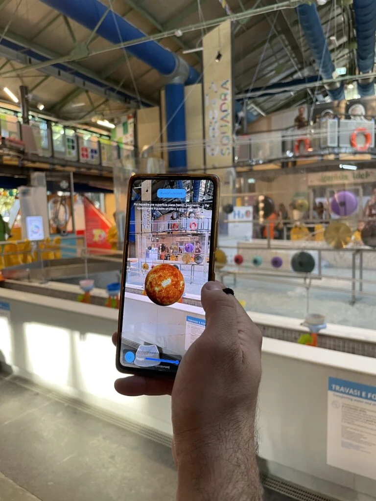

# SpaceWalk: AR Solar system experience

An AR experience that lets you navigate a model of the solar system using your smartphone. It is a geolocation-based augmented reality web app developed for the [National Institute for Astrophysics (INAF) of Italy](http://www.inaf.it), in collaboration with the [Explora Children's Museum of Rome](http://mdbr.it).

A scaled version of the solar system is deployed within a city, allowing users to explore the model and become aware of the actual scale and spatial relationships between the planets.

I was responsible for the full-stack development of this app, including the interactive user-facing side as well as the backend interface that enabled INAF experts to carefully deploy the models in selected cities.

Space Walk is a web app designed to make the discovery of astronomy accessible to everyone, transforming an ordinary walk through the city into an educational adventure.

Through augmented reality, the app allows users to explore the Sun and planets reproduced in 3D and at real scale, placed along urban routes that pass through sites of scientific, historical, and cultural interest. [More info here](https://mdbr.it/news/space-walk-il-sistema-solare-prende-vita-in-citta/)

