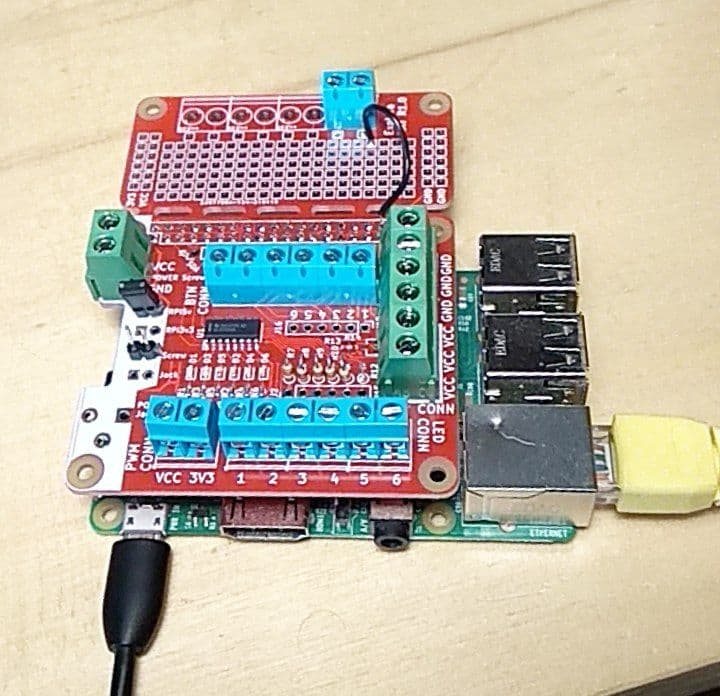

# Explora HAT

A Raspberry-pi HAT + python controller to streamline the deployment of interactive physical installations like the ones found on participative museums. 

This project is part of [Explora HUB](https://www.explorahub.eu/), an open repository curated by [Explora – The Children’s Museum of Rome](http://mdbr.it).
It offers access to software and resources crafted by Explora, all of which are available under Creative Commons licenses.

