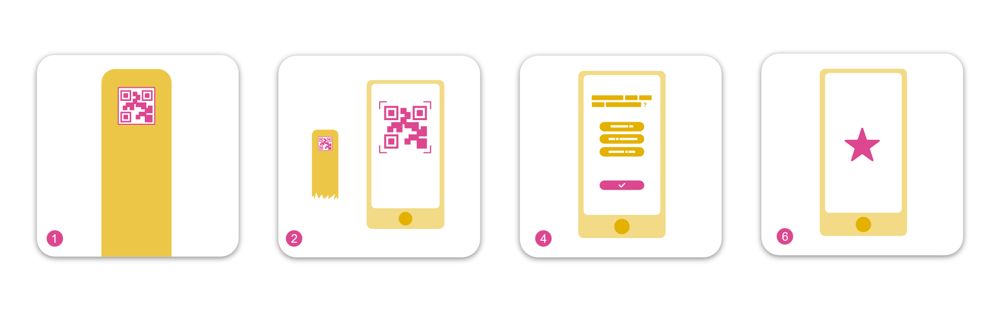

# Explora Scavenger hunt

Scavenger hunt is a web platform for a QR reading based quiz game. Through any mobile device camera it can scan different QR codes that start different quizzes. For any scanned QR the web platform serves a set of question and possible answers (behaving like radio buttons). If the answer given by user is correct the platform serves a badge with a hint of the position of next QR to scan.

This project is part of [Explora HUB](https://www.explorahub.eu/), an open repository curated by [Explora – The Children’s Museum of Rome](http://mdbr.it).
It offers access to software and resources crafted by Explora, all of which are available under Creative Commons licenses.

