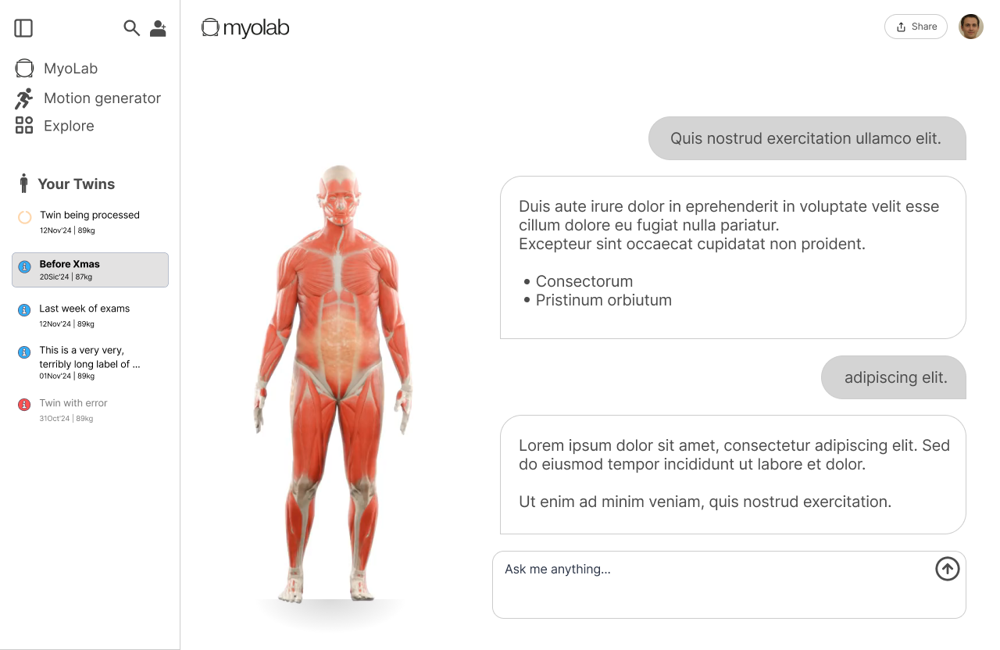
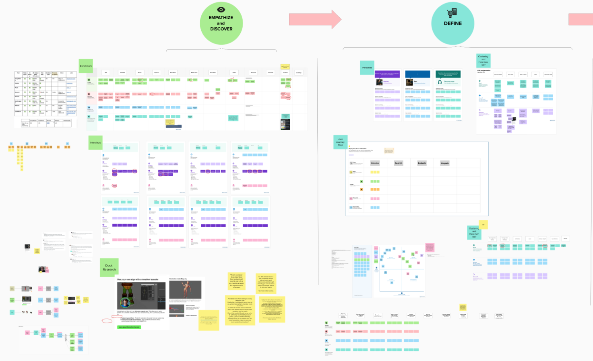

# User experience research at embedded AI company

I led the design and prototyping of several user interfaces for AI powered 3D modeling tools. Working in a fast paced startup environment, I balanced rapid iteration with user research to create interfaces that made complex technical workflows accessible.

The process involved drafting wireframes and high fidelity mockups for various interfaces, from 3D viewer components to infrastructure management dashboards. Each design cycle started with understanding user needs through direct feedback sessions, then translating those insights into functional prototypes for quick testing.

I integrated these designs into a structured UXR workflow, where each iteration fed into usability testing and informed the next round of improvements. This approach validated design decisions early and ensured the interfaces aligned with how users actually worked with the tools.

