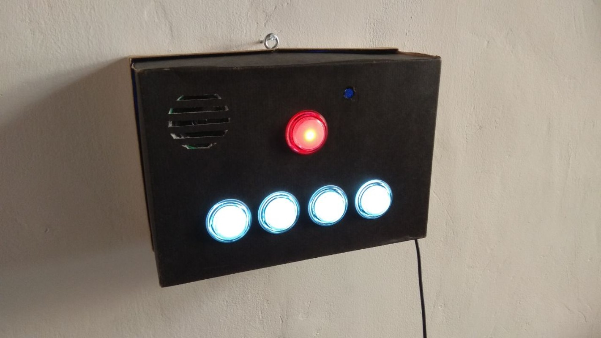
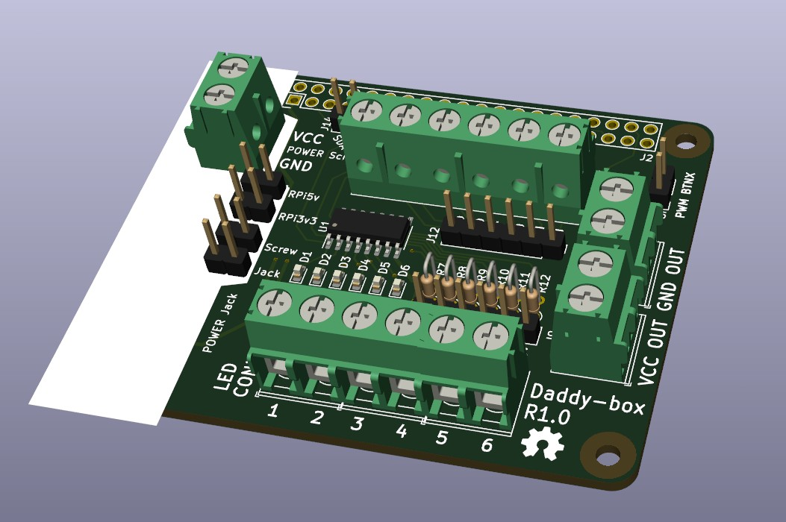
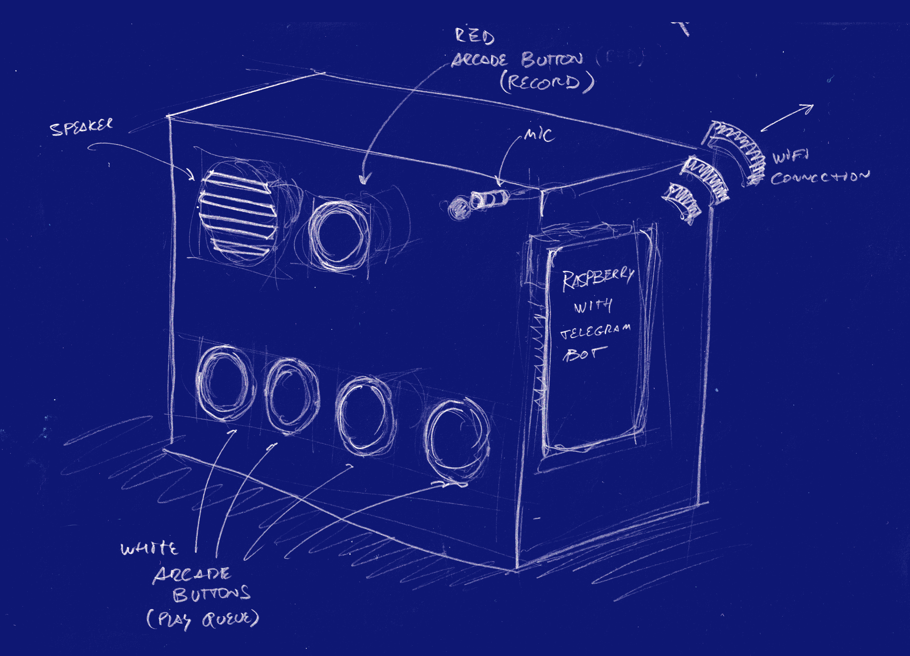

# Daddy box

A simplified, button-based interface for telegram voice chat for kids.

This was a personal project during the time of the pandemics. At some point I had to spend some time away from my -at the time- 4 year old daughter, and I wanted a way to have a communication channel.

So I created this box, with a Raspberry-pi inside, a microphone, a speaker and 5 big buttons:

- A red one to record a message that will arrive to my phone.
- Four white ones that will allow her to listen to the last vocal messages I sent her.

## Open Source

I released the sources to build this, including a convenient Raspberry pi hat facilitate the wiring.

See these repositories:

- [https://gitlab.com/daylanKifky/daddy-box-python-module](https://gitlab.com/daylanKifky/daddy-box-python-module)
- [https://gitlab.com/daylanKifky/daddy-box-raspberry-pi-hat](https://gitlab.com/daylanKifky/daddy-box-raspberry-pi-hat)

