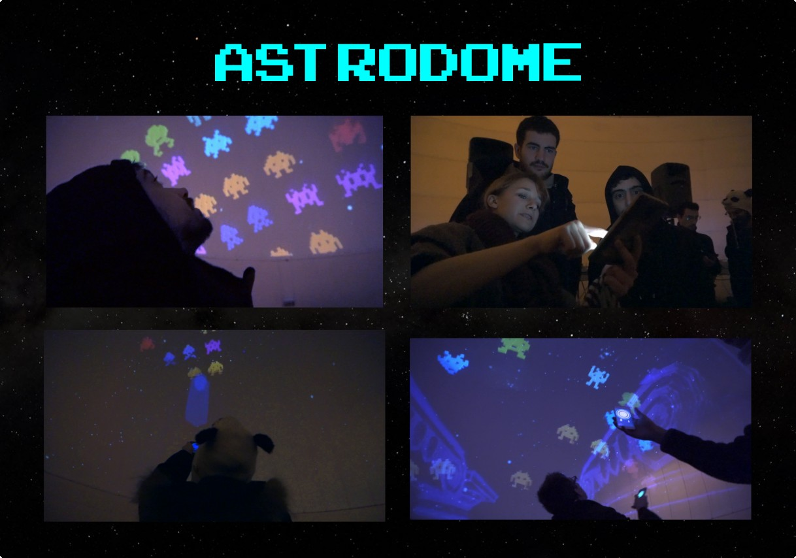

# Astrodome

Astrodome was an immersive installation and videogame. Projected onto a large dome using videomapping techniques, it allowed visitors to play an inverted version of the classic Space Invaders—shooting upwards at the invading creatures on the ceiling.

Participation was simple: anyone could join in by downloading an Android app. All they needed to do was point their device at a creature projected on the dome’s ceiling and press a button to fire a virtual laser beam.

Developed together with Michelle Laurenti as a weekend project, from a technological point of view it was an improvised Frankenstein, but the result was an awesome experience. The main application logic ran entirely inside Blender using `bpy`. The Android app was built with [Processing](https://processing.org/) and was deliberately simple: it calculated the device’s orientation and sent this data to the main app via [OSC](https://en.wikipedia.org/wiki/Open_Sound_Control). Since the dome could be roughly mapped to spherical coordinates and users typically played from near the center of the space, the 3D orientation of the device was all that was needed to aim the virtual laser gun.

Special thanks to Ugo Laurenti for producing this demo video, despite the challenging lighting conditions.

  <iframe
    style="position: absolute; top: 0; left: 0; width: 100%; height: 100%;"
    src="https://www.youtube.com/embed/o9c1uiQRGG8?si=6oXBMh84Hedq63QY"
    title="YouTube video player"
    frameborder="0"
    referrerpolicy="strict-origin-when-cross-origin"
    allowfullscreen
  ></iframe>

