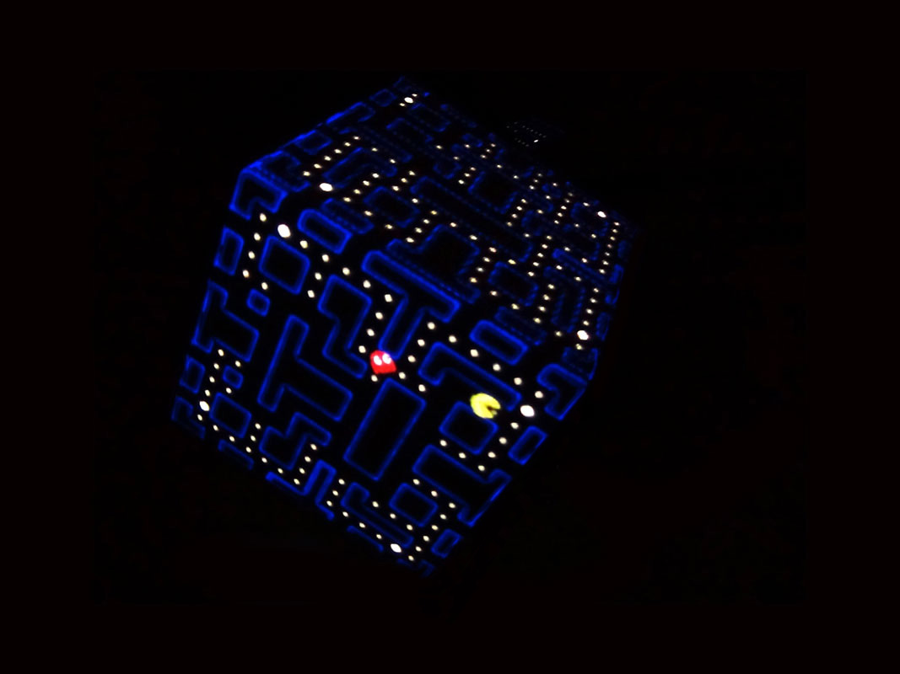
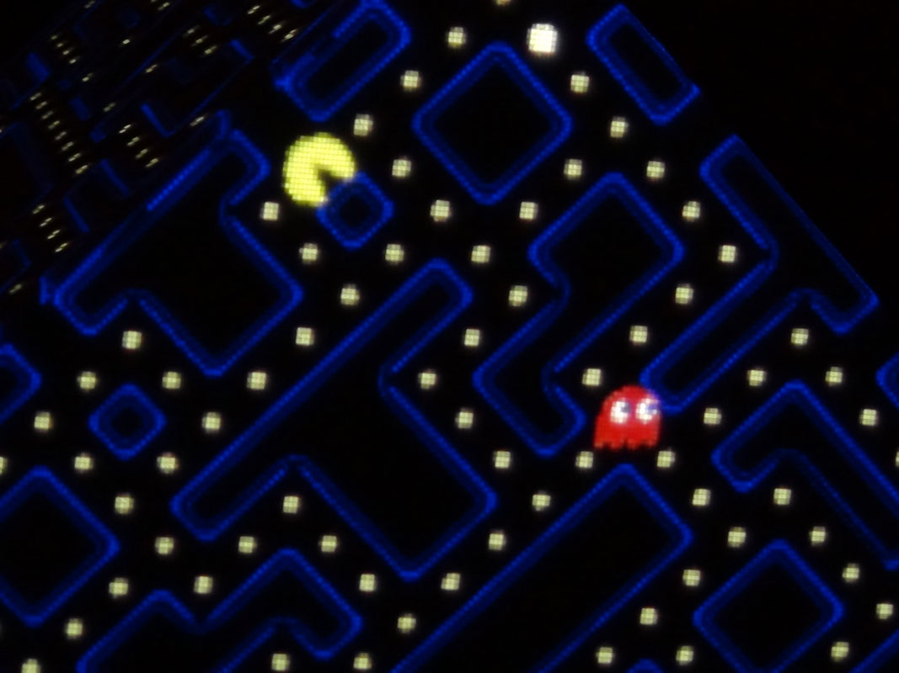

# PacMan Cube

A physical, interactive installation where the classic Pac-Man video game was mapped onto all six faces of a cube. This multiplayer, competitive version allowed one player to control Pac-Man while another controlled the ghosts.

Developed with [Processing](https://processing.org/) as a personal project, PacMan Cube was showcased at the 2014 edition of Maker Faire Rome.

<iframe src="https://player.vimeo.com/video/117863082?h=765da0c4fa" frameborder="0" allow="autoplay; fullscreen; picture-in-picture; clipboard-write; encrypted-media; web-share" referrerpolicy="strict-origin-when-cross-origin" style="position:absolute;top:0;left:0;width:100%;height:100%;" title="Pacman Cube"></iframe>

The **main challenge of this project was topological**: figuring out how to seamlessly connect the edges of the mazes to create a single, continuous playable surface. 

The setup involved projecting the game onto a white cube using a projector and two mirrors, with basic keystone correction implemented in software to align the visuals properly onto the physical cube.

