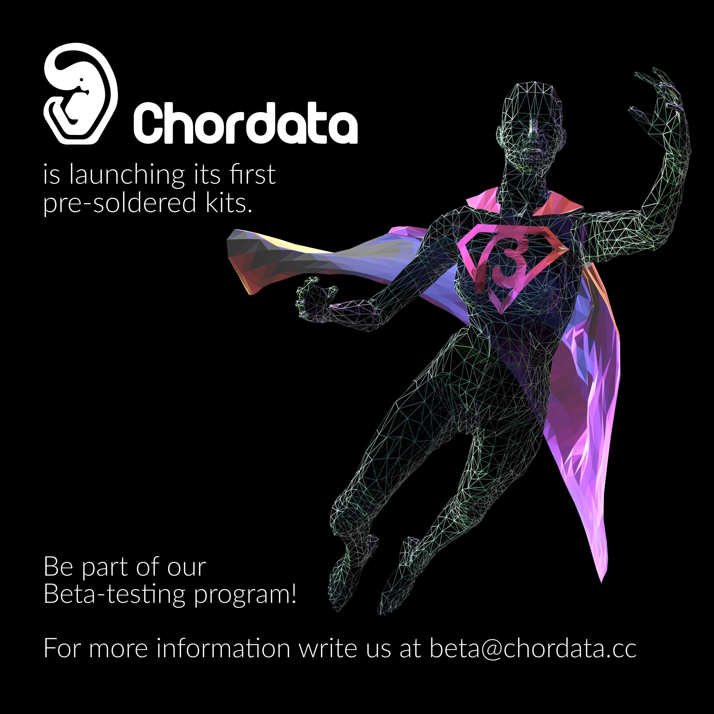

# Chordata mocap system

I was the creator and CTO of the [Chordata open source Motion Capture system](http://chordata.cc), where I led both the technical development and the community management aspects of this open-source initiative.

Chordata Motion emerged from a basic need: I wanted a way to register dance moves for [a performance piece](https://www.youtube.com/watch?v=NEPMSrVD6cU&t=37s), but none of the available tools matched my requirements. What started as a personal side project quickly evolved into a full-fledged open-source movement, attracting tech and communication enthusiasts eager to collaborate under the umbrella of open-source technologies.

## Community Building and Open Source Management

As the project gained traction, I took on the role of open source community manager, fostering a collaborative ecosystem around motion capture technology. My responsibilities included building and nurturing a community of developers, artists, researchers, and makers; managing contributions from diverse team members across different time zones and skill sets; developing clear documentation and maintaining forums; and establishing processes for code contributions and issue tracking for the [open hardware/software framework](https://gitlab.com/chordata). The main intention behind Chordata Motion was not just to deliver a software and hardware kit, but to build a sustainable community that supports and sustains the possibility of capturing movement with open technologies, requiring careful project management to balance technical development with community needs.

## Funding and Commercialization

Following a lean approach, before seeking venture capital or other institutional funding, we successfully carried out two beta testing programs where users acquired hardware kits, validating the product-market fit and gathering crucial feedback. To bring the project to a wider audience and enable commercial viability, I participated activelly -togheter with [my partners](https://chordata.cc/who-makes-chordata/index.html)- efforts to secure funding through both public and private channels. We launched a [Kickstarter campaign](https://www.kickstarter.com/projects/chordata-motion/chordata-motion-first-open-source-motion-capture-kit/) to fund the [first production run](https://www.youtube.com/watch?v=DlGjf-yO8p0) of the open-source motion capture kit, which required extensive planning, marketing coordination, and community mobilization. The campaign served as both a funding mechanism and a validation of the community's interest in open-source motion capture solutions, demonstrating demand for accessible tools in fields as diverse as game design, animation, digital arts, electronic music, gait analysis, and physical therapy. 

## Creative Direction

Beyond the technical and administrative aspects, I also served as the creative director for the project's visual and audiovisual requirements. This encompassed designing the brand identity, creating marketing materials, producing promotional videos, and overseeing the visual presentation of the system across various platforms and media formats.

