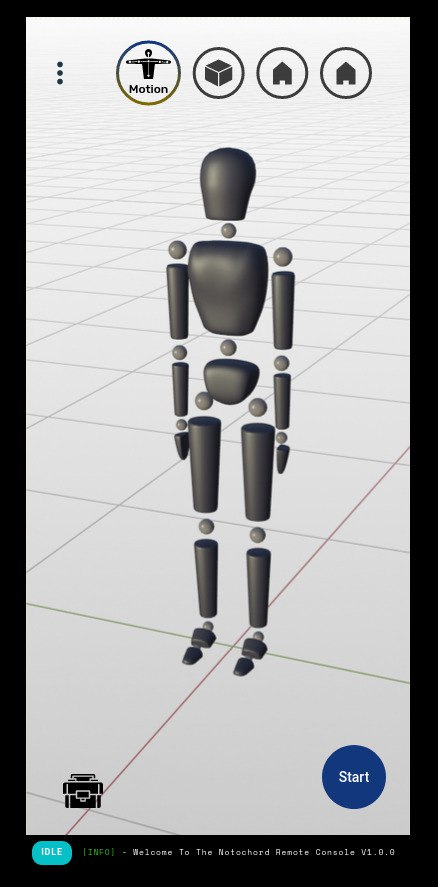

# Chordata: Remote console for motion capture

A web interface that allows you to receive, record, and retransmit physical motion capture data coming from a [Chordata open source motion capture system](http://chordata.cc)

The Chordata system was implemented as a distributed processing pipeline, where the sensor data was generated by the hardware the performer was wearing, and sent to a "Chordata client": a piece of software used to manage and visualize the capture. 

The remote console was a convenient client, since it allowed to manage the capture from any device, without the requirement of installing aditional software.

It was implemented as webapp, served from the Chordata's hardware, all the user needed to do was accesing it from a browser from within the same LAN.

