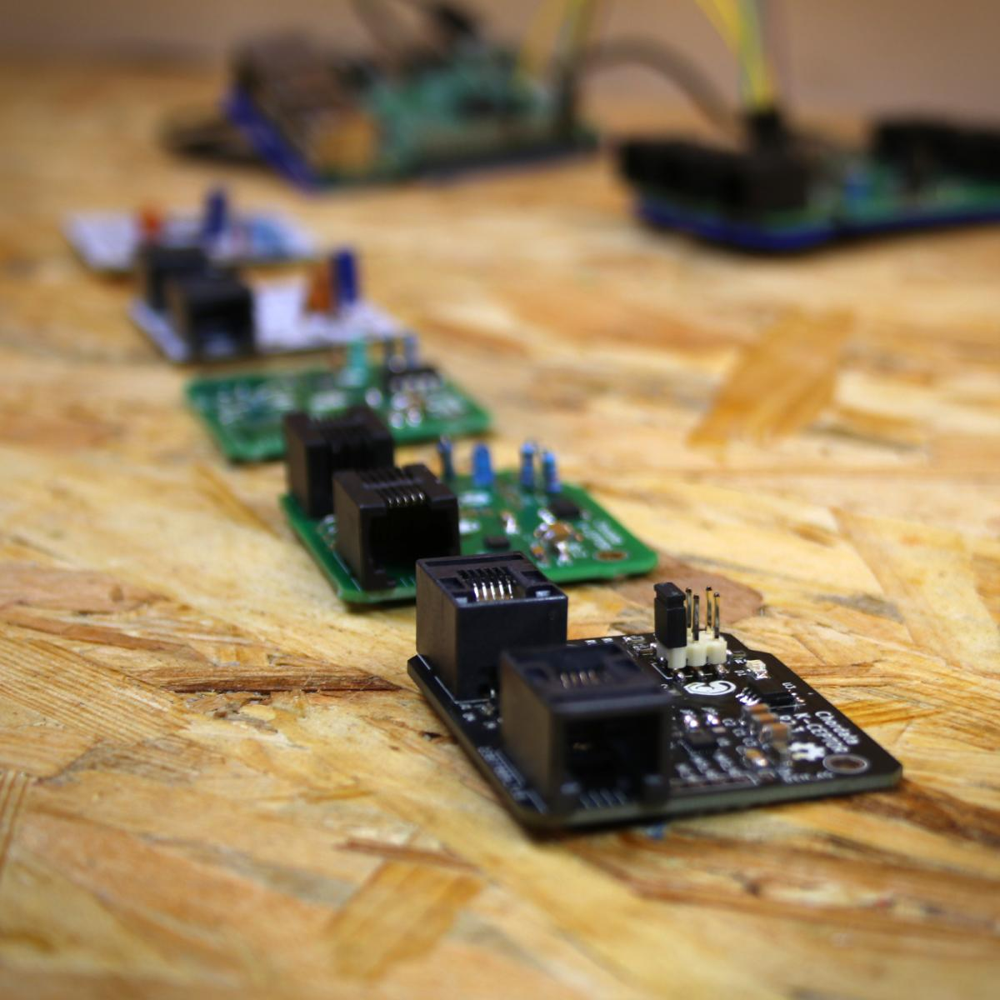
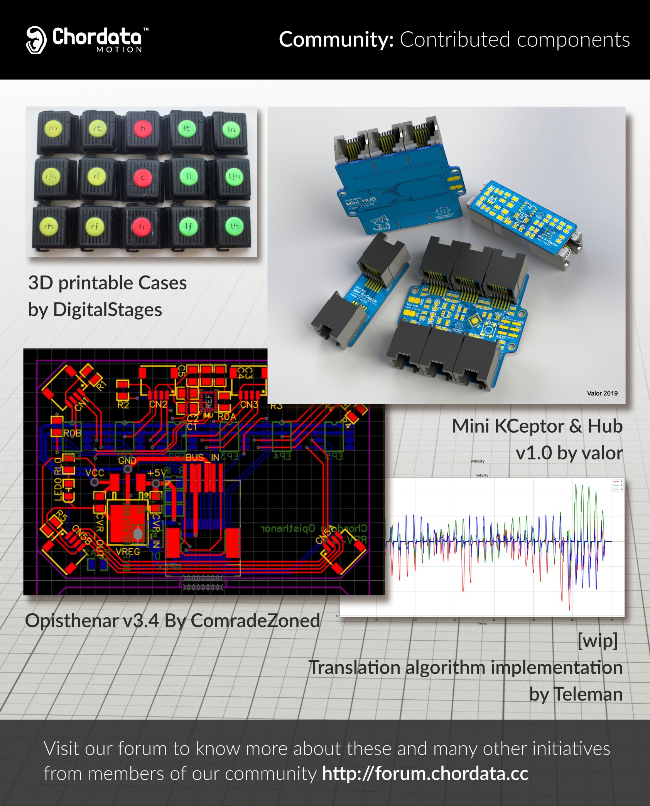
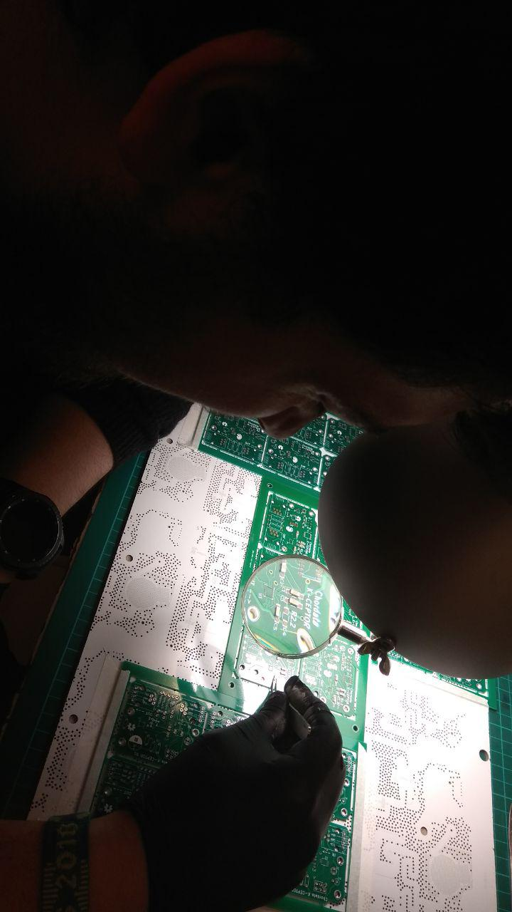

# Chordata: KCeptor Open hardware sensing unit

A hardware sensing unit for [Chordata open source motion capture system](http://chordata.cc)

These boards represented the early physical layer of the system, featuring an IMU + magnetometer sensors. They were attached to the performer body in strategic locations to be able to obtain inertial-based real-time motion capture

These boards were developed alongside the Chordata project, in collaboration with the community. Three official revisions were published, as well as a number of contributed ones.

These boards were initially released as sources, that the users could reproduce to build their own mocap gear. When the chordata project gained some traction we opened two beta-testing programs, through which the interested users were able to get pre-soldered kits. Those kits were entirely produced in-house, hand-soldering the components

