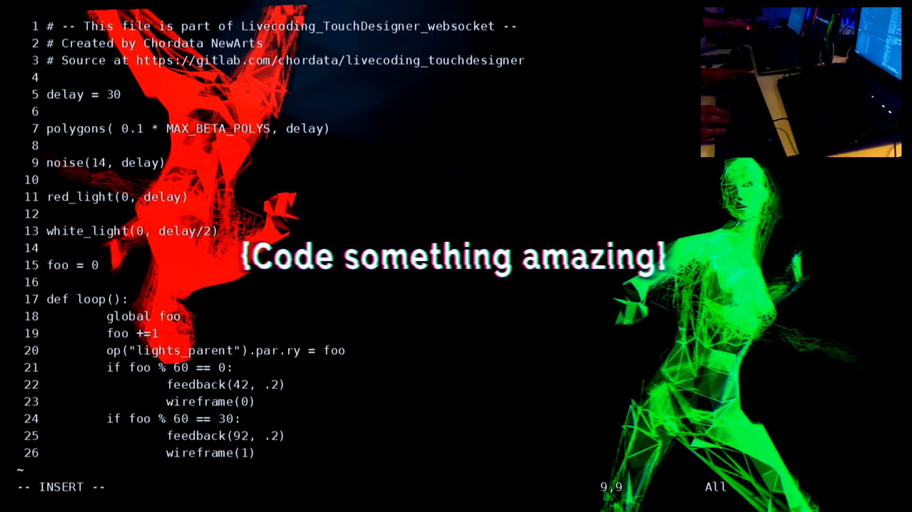
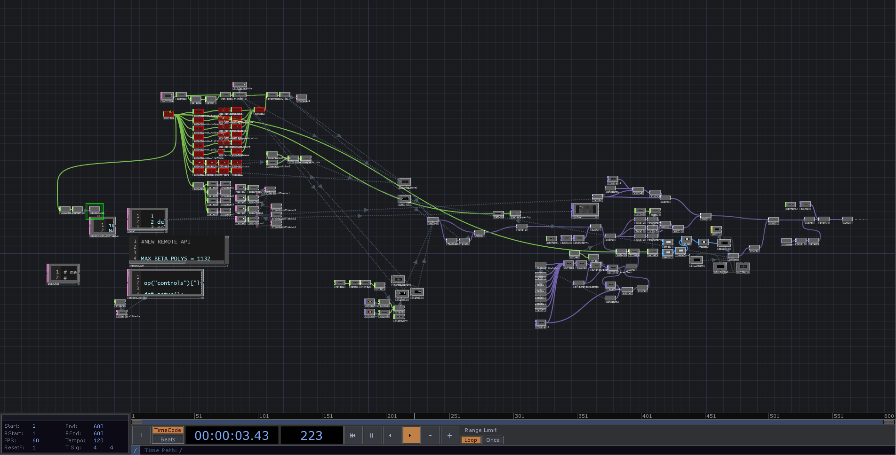

# Live coding performance

An on-stage performance combining live dance, real-time motion capture, and video generation through a live-coding interface.

In these performances, we captured and processed the movements of the dancer on stage, combining them with live-generated music to create real-time graphics using TouchDesigner.

For this edition, at the request of [Codemotion for the Amsterdam 2019 tech conference](https://events.codemotion.com/conferences/amsterdam/2019/), we included a live-coding interface that took advantage of the TMUX buffer, a VIM editor, and a Python infrastructure which transmitted and evaluated the live-generated script contents into a TouchDesigner patch. The images projected on the big screen were the result of the interaction between the team components:

- Arianna Serra: Dance
- Lorenzo Micozzi Ferri: Music and TouchDesigner
- Bruno Laurencich: Mocap and Live-coding

  <iframe
    style="position: absolute; top: 0; left: 0; width: 100%; height: 100%;"
    src="https://www.youtube.com/embed/NEPMSrVD6cU?si=muVo3xa6DlUSphmn"
    title="YouTube video player"
    frameborder="0"
    referrerpolicy="strict-origin-when-cross-origin"
    allowfullscreen
  ></iframe>

This [live-coding infrastructure was released](https://gitlab.com/chordata/livecoding_touchdesigner) under an Apache 2.0 License.

These mocap based performances gave birth to the [Chordata motion capture system](105_Chordata_mocap_system.html).

