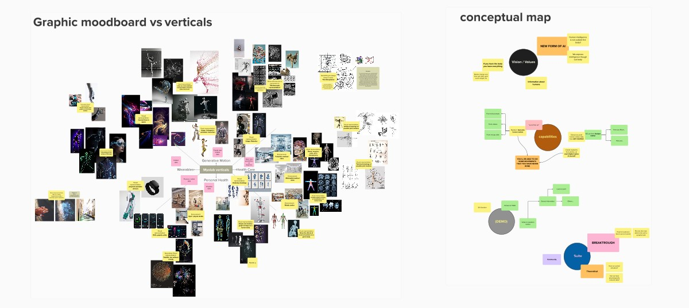

# Embodied AI Video Teaser

Led the end-to-end production of a short video teaser showcasing the core vision of an early-stage startup in the Embodied AI field.

Handled all visual design, animation, layout, and shading in `Blender`, leveraging `geometry nodes` for procedural effects. Final compositing and post-production were completed in `After Effects`.

Lorenzo Pandolfi led the audio design and production.

  <iframe
    style="position: absolute; top: 0; left: 0; width: 100%; height: 100%;"
    src="https://www.youtube.com/embed/FkSTln_qt5A?si=YCwnPsKtgDvYR39b"
    title="YouTube video player"
    frameborder="0"
    referrerpolicy="strict-origin-when-cross-origin"
    allowfullscreen
  ></iframe>

The "vision" of a startup in it's early stages is not something simple to express, so I worked closely with the managment team in the creative process.

I first drafted moodboards and conceptual maps:

Which lead to an storyboard:

And then to the final video:

