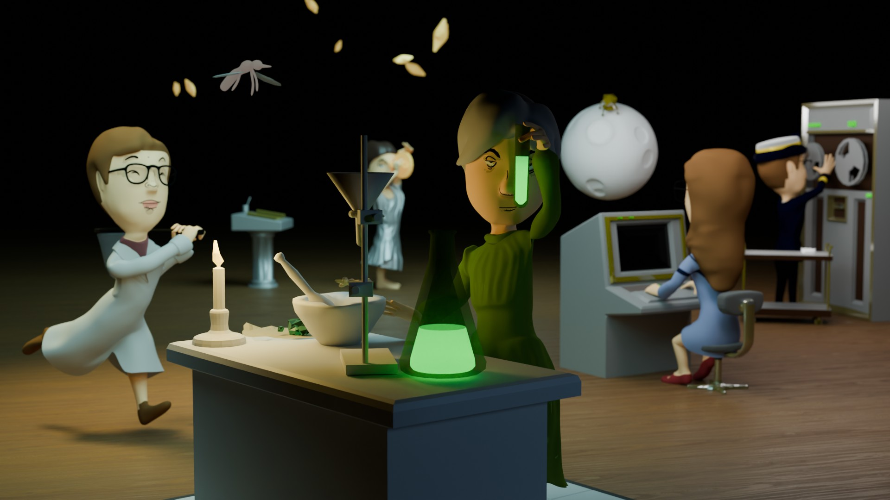

# STEM Muses Character Modeling and Animation

The STEM Muses project was an educational augmented reality application for children, centered around prominent female scientists who made significant contributions to their fields.
I was responsible for the low-poly modeling, animation, and optimization of the characters for use in web applications. For the animation, I brought each historical figure to life by crafting a unique looping action that reflects their scientific achievements in a way that's engaging for young audiences.

The characters included:

 - **Hypatia of Alexandria**: Astronomer and mathematician of ancient Greece.
 - **Tu YouYou**: Nobel Prize-winning pharmacist who discovered an active compound used in malaria treatments.
 - **Margaret Hamilton**: Scientist and programmer who wrote the control software for the Apollo 11 lunar module.
 - **Marie Curie**: Physicist and chemist, winner of two Nobel Prizes for her work with radioactivity.
 - **Grace Hopper**: Mathematician and one of the first computer programmers. She played a fundamental role in the creation of COBOL, one of the earliest programming languages.

 

  <iframe
    style="position: absolute; top: 0; left: 0; width: 100%; height: 100%;"
    src="https://www.youtube.com/embed/qlCUS6e9MhE?si=AXoBUixSQWI94_VG"
    title="YouTube video player"
    frameborder="0"
    referrerpolicy="strict-origin-when-cross-origin"
    allowfullscreen
  ></iframe>

