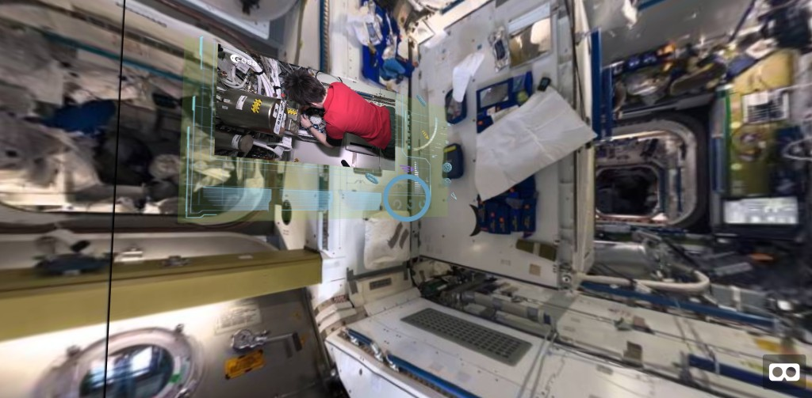

# VR International Space Station Viewer

This project is an immersive web application that allows users to virtually explore the interior of the International Space Station (ISS) using a VR headset. Within this interactive environment, users can freely navigate the ISS modules, discover educational content, watch related videos, and access up-to-date news about ongoing missions and scientific experiments aboard the station.

The experience is designed to be engaging for a wide audience, offering both a realistic sense of presence and rich multimedia integration to deepen understanding of life and work in space.

