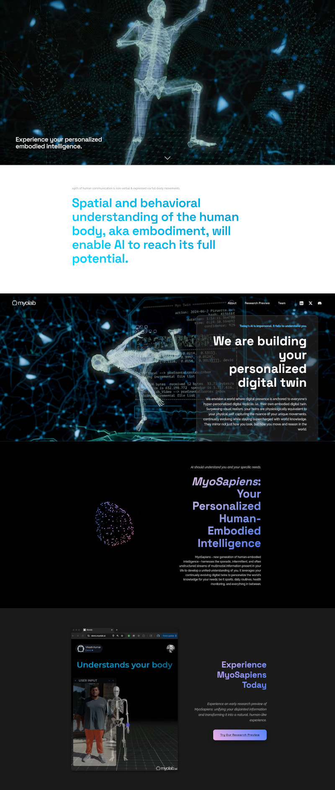

# Myolab Landing Page

At [myolab.ai](http://myolab.ai), I was responsible for the design, and deployment of the company's landing page.

This is a one page website built with modern semantic HTML5 and JavaScript, following responsive and contemporary UI principles. The landing page highlights the company's vision, integrating custom-designed video teaser assets that I produced to enhance engagement and storytelling.

